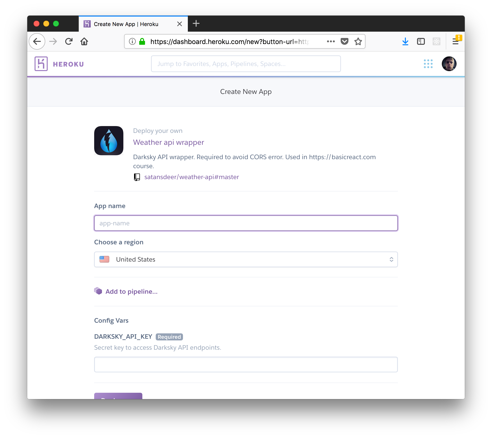

# ~~Darksky~~ AccuWeather API Wrapper

They take security very seriously at ~~Dark Sky~~ AccuWeather. As a security precaution they have disabled cross-origin resource sharing (CORS) on their servers.

This is small and simple wrapper to make calls to ~~Darksky~~ AccuWeather API.

## How To Use

First you have to register on [AccuWeather](https://developer.accuweather.com/user/me/apps) and get 2 API keys; one for core and one for minutely. Next register on [heroku.com](https://heroku.com). After that just press the Deploy To Heroku button above.

You'll be prompted with app creation screen.

Enter your app name and API keys you got from Darksky. Click the __Deploy app__ button.

Now you can click the __View__ button and go to your app url.

To get forecast you need to provide latitude and longitude:

`<your-app-url>/forecast/minute/<latitude>,<longitude>`
`<your-app-url>/forecast/geoPos/<latitude>,<longitude>`
`<your-app-url>/forecast/core/<geoPos>`

You should get `JSON` response with forecast.
